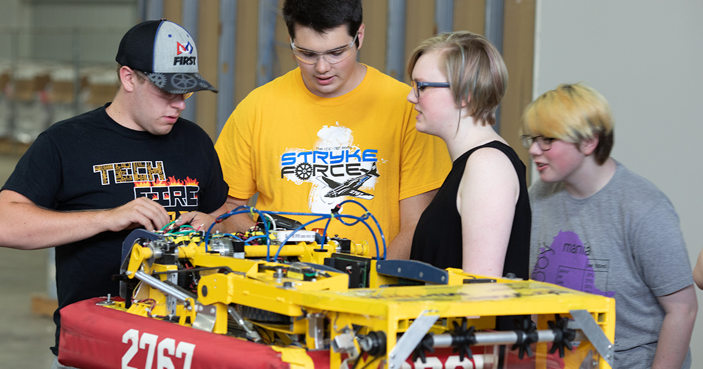

Hi my name is Jack B.  My mom, dad and brother are founding members of Stryke Force.  When I was in 7th grade a few others started 7228, a FTC team.  Since then I’ve moved up to FRC and will be a senior this year.  I’ve seen a lot of mechanical iterations over the years, especially on our swerve drive.
<!--more-->

We held a lessons learned in June where we discussed many pros and areas of improvements.  This gave us direction for summer and fall projects.

We are focusing on teaching rookies both new to this program and students coming from FTC the basics of tools, design, CAD and any other skills that will help them and the team improve.  We are working on many projects.  We are looking at ways to improve our swerve; always looking to make it lighter and faster.

We’ve begun a CAD class that focuses on robot design.  I have really been enjoying this! 
We have students and mentors working on cross discipline projects to address autonomous and swerve integrations.  Making a swerve drive straight is trickier than it sounds.

Along with various other projects we are working on some pit and build space organizing.

We are also working on a plan for team integration.  The mechanical team is working with the business team to garner partnerships with area business professionals to build a strong team and community.
