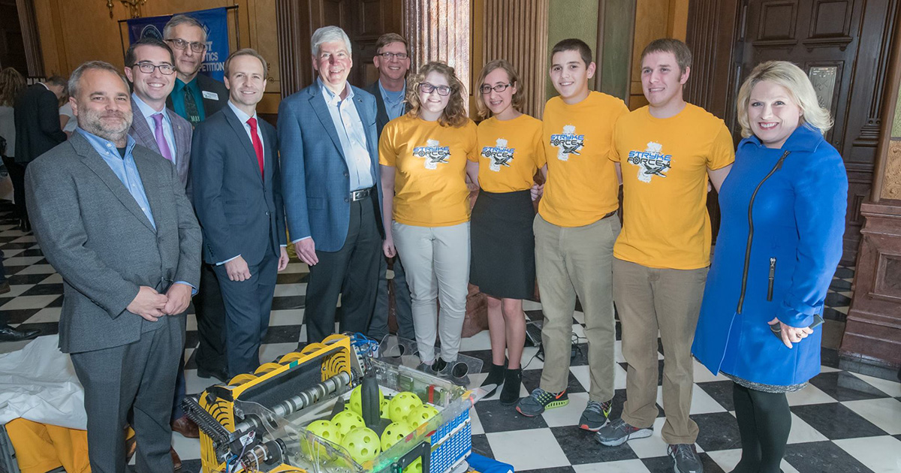

The 2019 state education budget is not only good news for Stryke Force, but the entirety of *FIRST* as well!

<!--more-->

Michigan Governor Rick Snyder (who has personally met Stryke Force members at the State Capitol) has increased the amount of money allotted to support *FIRST* robotics competitions to $500,000. Snyder recently signed the $16.8 billion state education budget into law, and even said that it was one of the best he’s ever seen as governor. 

The decision came after Snyder himself toured Ypsilanti Community High School to tour the school’s own robotics program. According to Michigan Live, Snyder describes himself as an "uber fan" of *FIRST* robotics, and his passion seems genuine given the recent legislative action he has helped pass. 

Of course, that's all good news to hear back at Midlink, Stryke Force's build space.
