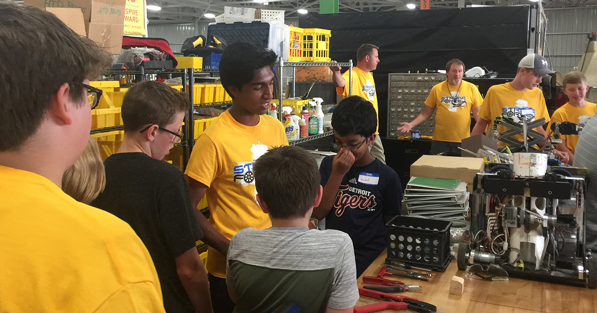

The 2018 FIRST Tech Challenge (FTC) season is starting soon, and Stryke Force is gearing up for action! 
<!--more-->

New members of the Stryke Force [FTC](/about/ftc) team participated in a day of mentoring, where I and my team members on the FIRST Robotics Competition (FRC) team introduced the basics of robotics. We gave the younger members a tour of the facility and robots from prior years. We showed them various power tools, including the band saw, drill press, and hand drills. They learned when and how to use each tool as well as tips on how to be safe when using the power tools. We also talked about how to go through the rules of the game before building and programming the robot. 

As a returning member on the FRC team, it was great to pass on to the younger FTC members the information I had learned from my time at Stryke Force. Throughout the discussions, the students remained engaged by asking lots of questions, interacting with the tools, and working together to record their reflections for the engineering notebook. Most importantly, the students learned about each other and made new friendships!

Good luck to the Stryke Force FTC team. I’m really looking forward to watching them compete this upcoming season!