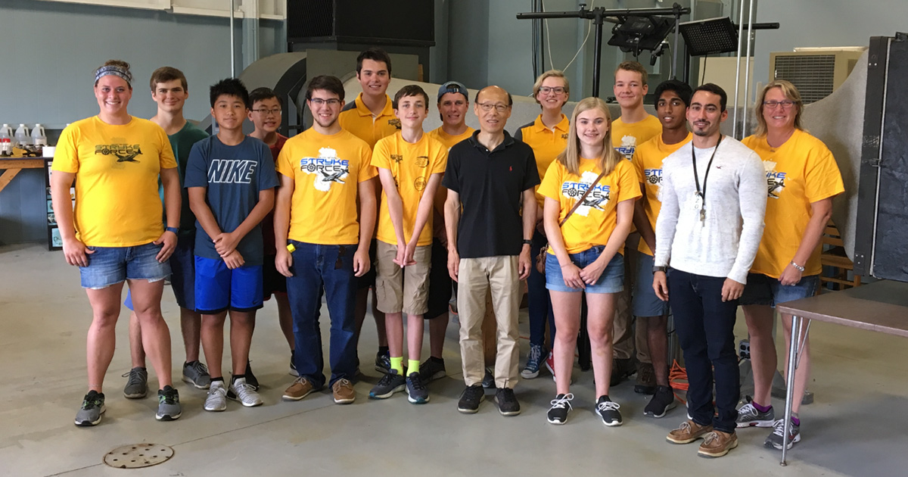

Stryke Force students got the opportunity to tour of Western Michigan University’s Applied Aerodynamics Laboratory with Dr. Tianshu Liu and learn about Western’s Aerospace Engineering program.
<!--more-->

As a high school senior interested in aerospace engineering as a college option, it was fantastic to be able to get a tour of WMU’s Aerodynamics Lab. We learned about the wind tunnel facilities at WMU and got a demonstration of both the small and large wind tunnels from Dr. Liu and several of WMU’s aerospace students. Dr. Liu gave us a presentation about what Western Michigan’s Aerospace Engineering program does, as well as a few lessons in aerodynamics. He showed us several airfoil designs and we talked about how an airfoil works and how wind tunnels are used to design them. We also learned about the aerodynamics involved in the design of cars and how airfoils are being incorporated into cars as well as aircraft.

Thanks again to Dr. Liu for taking the time to give us a tour of WMU’s Aerodynamics Lab!
