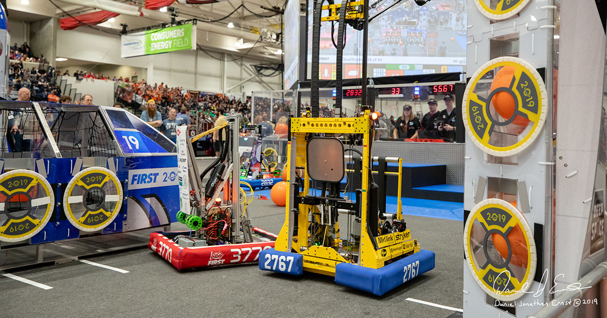

During the summer, the team is planning to do a little bit of traveling and
attend three events outside of the regular season.

<!--more-->

The goal of these robotics competitions is to get some real event experience
for the drive team, pit crew, and students to get ready for the 2020 season.
Therefore, we highly encourage all of our students to take some time off from
their other activities during the warm months and travel and learn with the
team.

Put these on your calendar! More information about each event can be found from
their respective websites.

**[Indiana Robotics Invitational](http://indianaroboticsinvitational.org/)** 
**Friday, July 12, 2019- Saturday, July 13, 2019** 
Lawrence North High School 
7802 Hague Rd 
Indianapolis, IN 46256

**[Mid Mitten Robo Rodeo](https://midmittenroborodeo.com/)** 
**Saturday, August 10, 2019 9:00 AM – 8:00 PM.** 
Lakewood High School 
7223 Velte Rd. 
Lake Odessa, MI 48849

**[West Michigan Robotics Invitational (WMRI)](http://www.wmri.info/home)** 
**Saturday, October 19, 2019**  
Zeeland East High School 
3333 96th Avenue 
Zeeland, MI 49464
